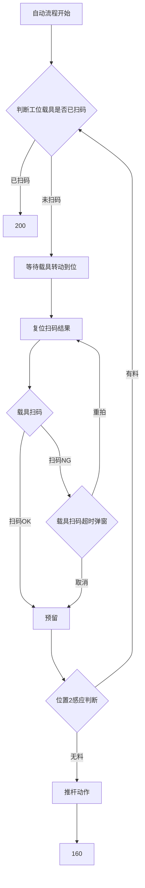

```mermaid
graph TD
自动流程开始--->
10{判断工位载具是否已扫码}--->|已扫码|200
10---->|未扫码|100
100[等待载具转动到位]--->110
110[复位扫码结果]--->120
120{载具扫码}--->|扫码OK|130
120--->|扫码NG|125
125{载具扫码超时弹窗}--->|重拍|110
125--->|取消|130
130[预留]--->140
140{位置2感应判断}--->|有料|10
140--->|无料|150
150[推杆动作]--->160
160

  
```