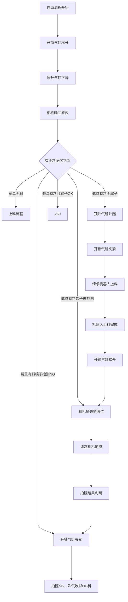

```mermaid
graph TD
自动流程开始--->10
10[开锁气缸松开]--->20
20[顶升气缸下降]--->30
30[相机轴回原位]--->40
40{有无料记忆判断}--->|载具无料|50
40--->|载具有料无端子|100
40--->|载具有料端子未检测|150
40--->|载具有料端子检测NG|200
40--->|载具有料且端子OK|250
50[上料流程]
100[顶升气缸升起]--->110
110[开锁气缸夹紧]--->120
120[请求机器人上料]--->130
130[机器人上料完成]--->140
140[开锁气缸松开]---->150
150[相机轴去拍照位]--->160
160[请求相机拍照]---->170
170[拍照结果判断]---->200
200[开锁气缸夹紧]---->210
210[拍照NG，吹气吹掉NG料]
```