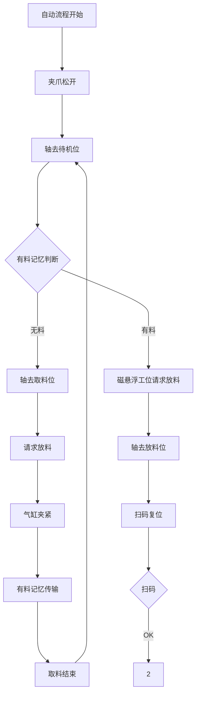

```mermaid
graph TD
自动流程开始--->10
10[夹爪松开]--->20
20[轴去待机位]---->30
30{有料记忆判断}---->|无料|100
30---->|有料|200
100[轴去取料位]--->110
110[请求放料]--->120
120[气缸夹紧]--->130
130[有料记忆传输]--->140
140[取料结束]---->20
200[磁悬浮工位请求放料]--->210
210[轴去放料位]--->215
215[扫码复位]--->220
220{扫码}--->|OK|2
```