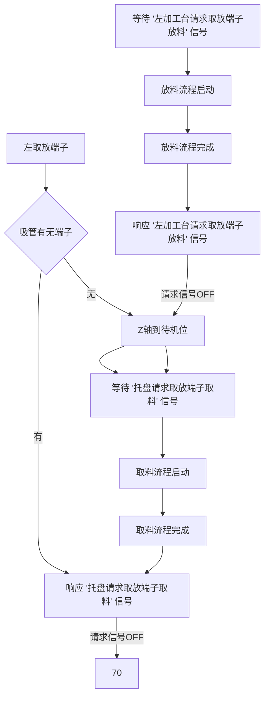

```mermaid
graph TD
0[左取放端子]-->10
10{吸管有无端子}-->|有|60
10-->|无|20
20[取端子Y轴到取端子位]-->30
20[Z轴到待机位]-->30
30[等待 '托盘请求取放端子取料' 信号]-->40
40[取料流程启动]-->50
50[取料流程完成]-->60
60[响应 '托盘请求取放端子取料' 信号]-->|请求信号OFF|70
80[等待 '左加工台请求取放端子放料' 信号]-->90
90[放料流程启动]-->100
100[放料流程完成]-->110
110[响应 '左加工台请求取放端子放料' 信号]-->|请求信号OFF|20
```