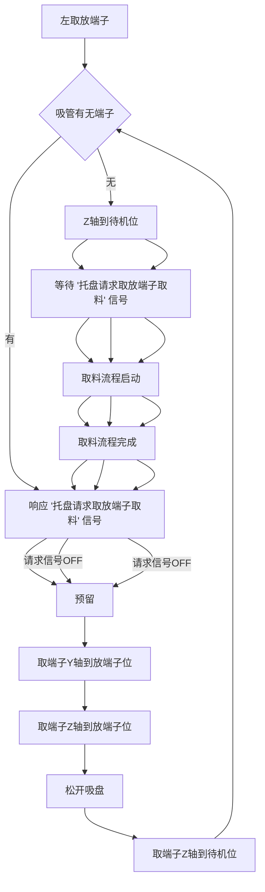

```mermaid
graph TD
0[左取放端子]-->10
10{吸管有无端子}-->|有|60
10-->|无|20
20[取端子Y轴到取端子位]-->30
30[托盘X轴到取端子位]-->40
40[取端子Z轴到取端子位]-->50
50[启动吸盘]-->60
60[取端子Z轴到待机位]-->70
70[预留]-->80
80[取端子Y轴到放端子位]-->90
90[取端子Z轴到放端子位]-->100
100[松开吸盘]-->110
110[取端子Z轴到待机位]-->10

20[Z轴到待机位]-->30
30[等待 '托盘请求取放端子取料' 信号]-->40
40[取料流程启动]-->50
50[取料流程完成]-->60
60[响应 '托盘请求取放端子取料' 信号]-->|请求信号OFF|70
30[等待 '托盘请求取放端子取料' 信号]-->40
40[取料流程启动]-->50
50[取料流程完成]-->60
60[响应 '托盘请求取放端子取料' 信号]-->|请求信号OFF|70
```