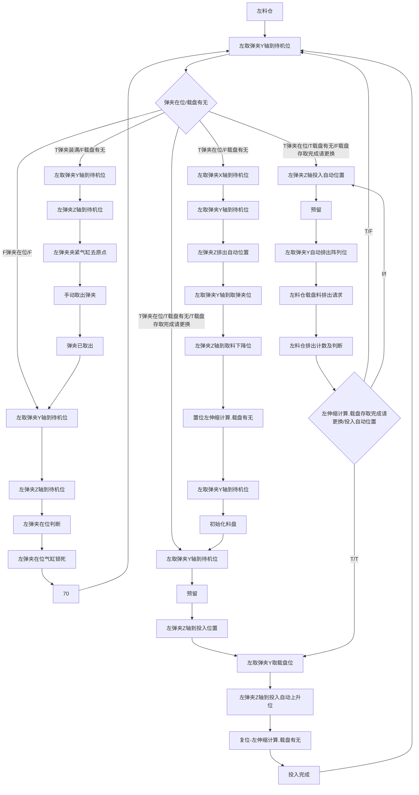

```mermaid
graph TD
0[左料仓]-->10
10[左取弹夹Y轴到待机位]-->20
20{弹夹在位/载盘有无}-->|F弹夹在位/F|30
20-->|T弹夹在位/F载盘有无|100
20-->|T弹夹在位/T载盘有无/F载盘存取完成请更换|400
20-->|T弹夹在位/T载盘有无/T载盘存取完成请更换|200
20-->|T弹夹装满/F载盘有无|300
30[左取弹夹Y轴到待机位]-->40
40[左弹夹Z轴到待机位]-->50
50[左弹夹在位判断]-->60
60[左弹夹在位气缸锁死]-->70
70-->10
100[左取弹夹X轴到待机位]-->110
110[左取弹夹Y轴到待机位]-->120
120[左弹夹Z排出自动位置]-->130
130[左取弹夹Y轴到取弹夹位]-->140
140[左弹夹Z轴到取料下降位]-->150
150[置位左伸缩计算.载盘有无]-->160
160[左取弹夹Y轴到待机位]-->170
170[初始化料盘]-->200
200[左取弹夹Y轴到待机位]-->210
210[预留]-->220
220[左弹夹Z轴到投入位置]-->230
230[左取弹夹Y取载盘位]-->240
240[左弹夹Z轴到投入自动上升位]-->250
250[复位-左伸缩计算.载盘有无]-->260
260[投入完成]-->10
300[左取弹夹Y轴到待机位]-->310
310[左弹夹Z轴到待机位]-->320
320[左弹夹夹紧气缸去原点]-->330
330[手动取出弹夹]-->340
340[弹夹已取出]-->30
400[左弹夹Z轴投入自动位置]-->410
410[预留]-->420
420[左取弹夹Y自动排出阵列位]-->430
430[左料仓载盘料排出请求]-->440
440[左料仓排出计数及判断]-->450
450{左伸缩计算.载盘存取完成请更换/投入自动位置}-->|T/F|10
450-->|T/T|230
450-->|f/f|400


```