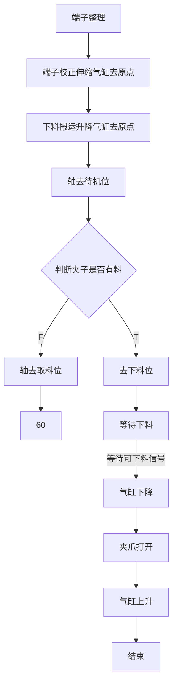

```mermaid
graph TD
0[端子整理]-->10
10[端子校正伸缩气缸去原点]-->20
20[下料搬运升降气缸去原点]-->30
30[轴去待机位]-->40
40{判断夹子是否有料}-->|T|130
40-->|F|50
50[轴去取料位]-->60
%% 60[夹爪打开]-->70
%% 70[下降到位]-->80
%% 80[夹爪加紧]-->90
%% 90[校正伸出]-->100
%% 100[预留]-->110
%% 110[校正缩回]-->120
%% 120[气缸上升]-->130
130[去下料位]-->140
140[等待下料]-->|等待可下料信号|150
150[气缸下降]-->160
160[夹爪打开]-->170
170[气缸上升]-->180
180[结束]


  
```