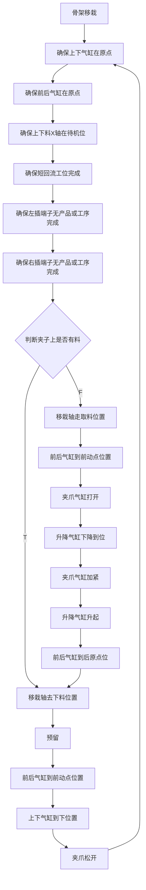

```mermaid
graph TD
   0[骨架移栽]-->10
   10[确保上下气缸在原点]-->20
   20[确保前后气缸在原点]-->30
   30[确保上下料X轴在待机位]-->40
   40[确保短回流工位完成]-->50
   50[确保左插端子无产品或工序完成]-->60
   60[确保右插端子无产品或工序完成]-->70
   70{判断夹子上是否有料}-->|F|80
   70-->|T|150
   80[移栽轴走取料位置]-->90
   90[前后气缸到前动点位置]-->100
   100[夹爪气缸打开]-->110
   110[升降气缸下降到位]-->120
   120[夹爪气缸加紧]-->130
   130[升降气缸升起]-->140
   140[前后气缸到后原点位]-->150
   150[移栽轴去下料位置]-->160
   160[预留]-->170
   170[前后气缸到前动点位置]-->180
   180[上下气缸到下位置]-->190
   190[夹爪松开]-->10


  
```