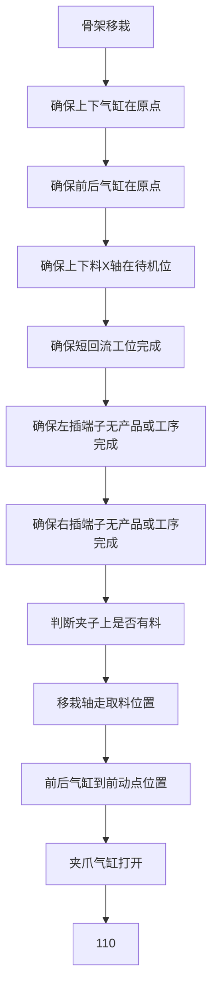

```mermaid
graph TD
   0[骨架移栽]-->10
   10[确保上下气缸在原点]-->20
   20[确保前后气缸在原点]-->30
   30[确保上下料X轴在待机位]-->40
   40[确保短回流工位完成]-->50
   50[确保左插端子无产品或工序完成]-->60
   60[确保右插端子无产品或工序完成]-->70
   70[判断夹子上是否有料]-->80
   80[移栽轴走取料位置]-->90
   90[前后气缸到前动点位置]-->100
   100[夹爪气缸打开]-->110
   110


  
```