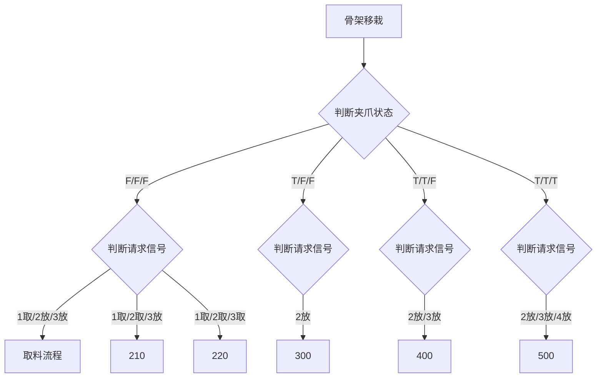

```mermaid
graph TD
0[骨架移栽]-->10
10{判断夹爪状态}-->|F/F/F|20
10-->|T/F/F|30
10-->|T/T/F|40
10-->|T/T/T|50

20{判断请求信号}-->|1取/2放/3放|200
20-->|1取/2取/3放|210
20-->|1取/2取/3取|220
200[取料流程]
30{判断请求信号}-->|2放|300
40{判断请求信号}-->|2放/3放|400
50{判断请求信号}-->|2放/3放/4放|500
```